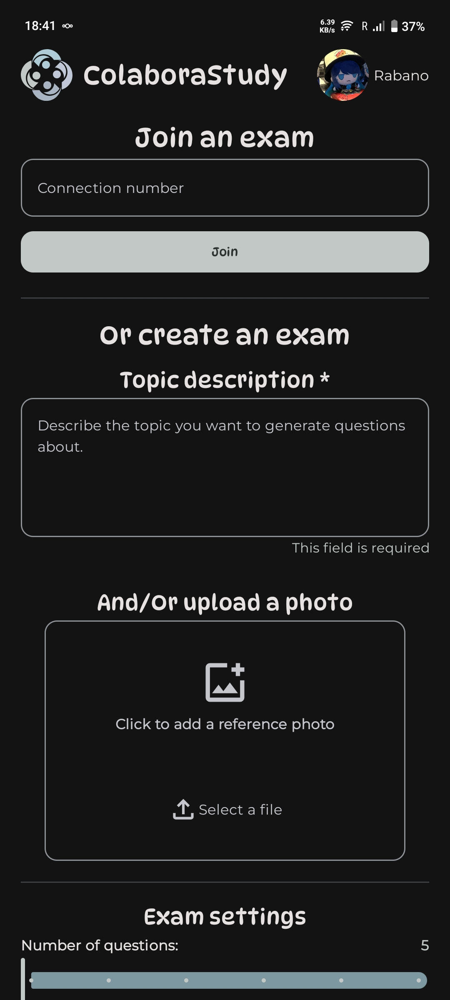
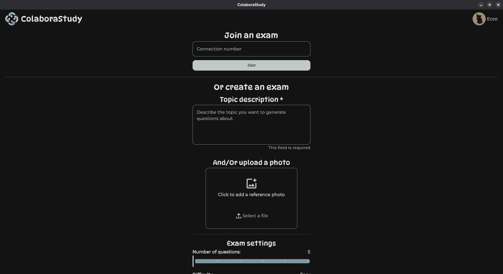
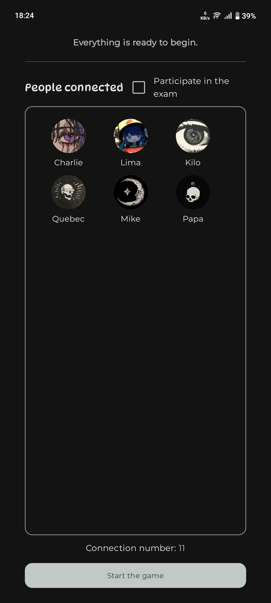
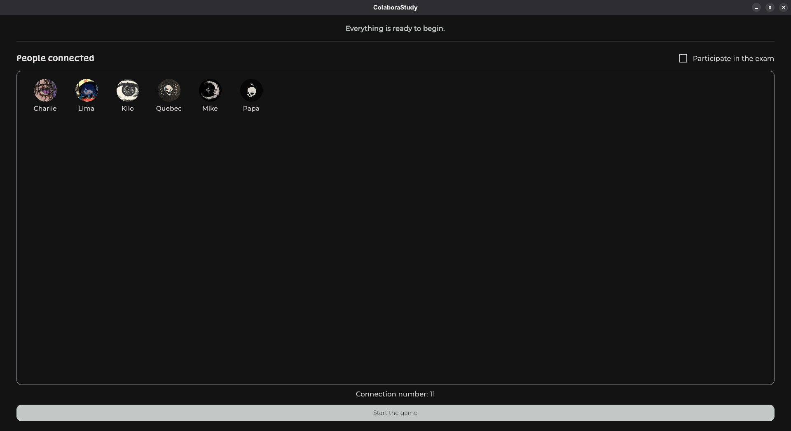
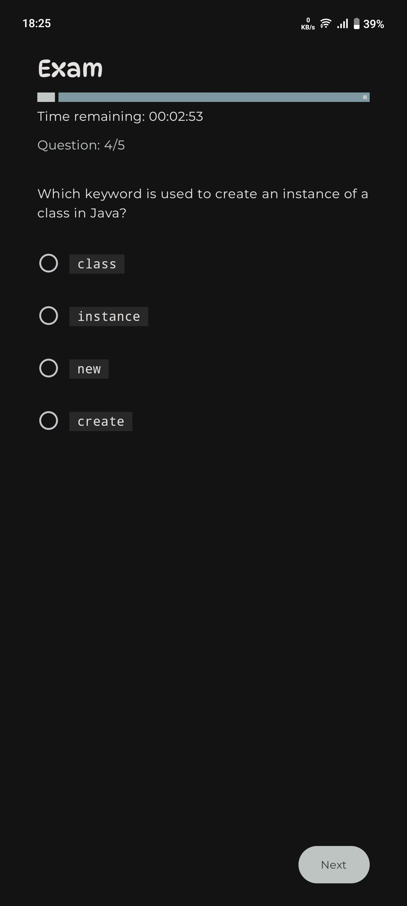
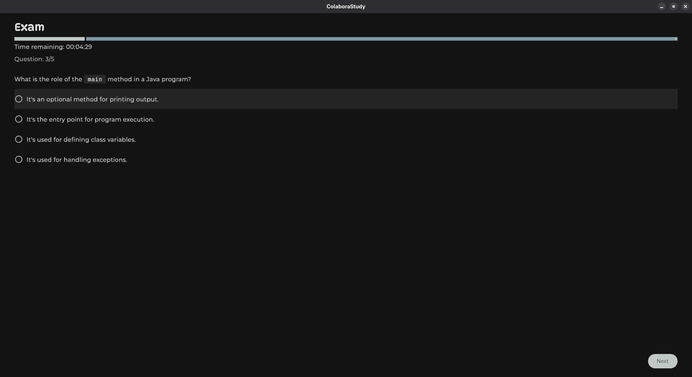
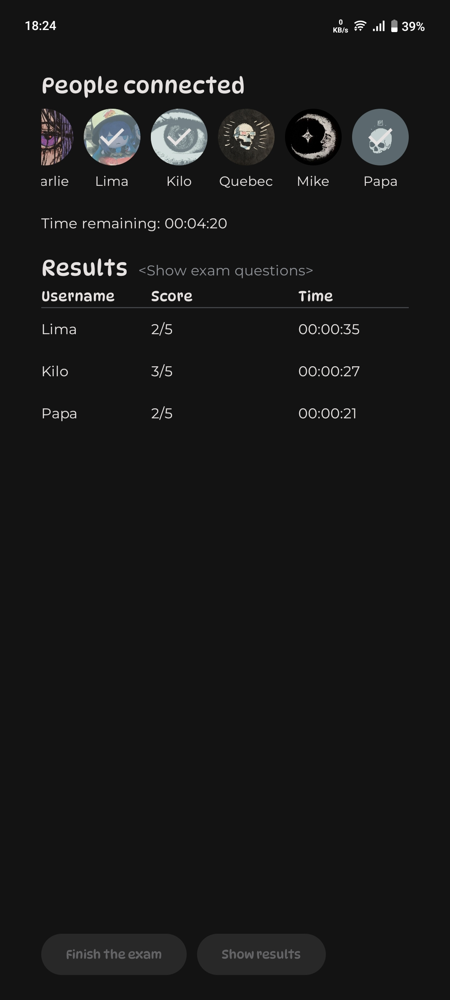
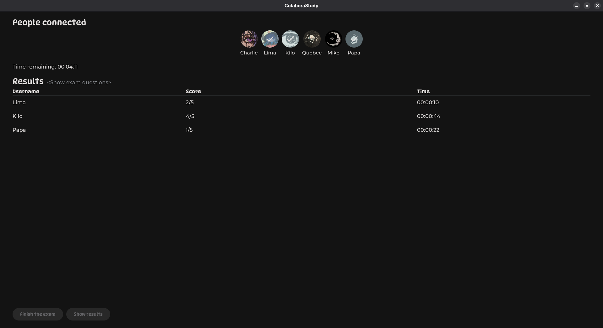
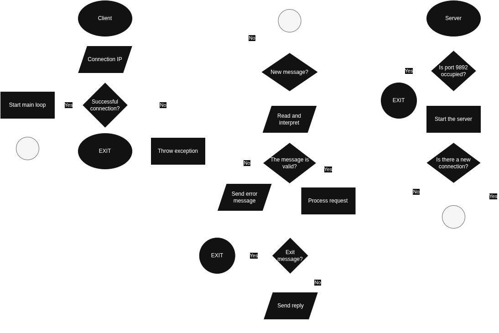

<h1 align="center">
	
	<p>ColaboraStudy</p>
</h1>

**ColaboraStudy** es una aplicación *multiplataforma* de *aprendizaje colaborativo* que utiliza la Inteligencia Artificial de [Google Gemini](https://gemini.google/mx/about/) para generar exámenes de práctica automáticos. El sistema permite transformar *contenidos de estudio en evaluaciones* dinámicas, facilitando el *estudio grupal* de forma inmediata.

Su arquitectura está diseñada para *superar limitaciones de conectividad*: basta con que una sola persona tenga acceso a internet para *generar un examen* y distribuirlo a los demás a través de una red local (intranet). Además, permite exportar e importar exámenes, garantizando que el material esté siempre disponible ***sin** depender de la nube*.

### Beneficios
* **Eficiencia con IA:** Generación automática de preguntas inteligentes.
* **Modo Híbrido:** Conexión grupal offline mediante un único punto de acceso a internet.
* **Portabilidad:** Exportación e importación de archivos para estudiar en cualquier momento.
* **Inclusión Digital:** Funciona perfectamente en entornos con conexión inestable o limitada.

### Capturas
#### Home
<p align="center">
	
	
</p>

#### Personas conectadas
<p align="center">
	
	
</p>

#### Examen
<p align="center">
	
	
</p>

#### Puntuación
<p align="center">
	
	
</p>

## Despliegue de la aplicación
### Plataformas soportadas
| Android | IOS | JVM (EScritotio) |
|---------|-----| ---------------- |
|    ✅   |  ❓ |       ✅         |
> [!WARNING]
> No a sido probada en sistemas **IOS**, puede tener *fallos*

### Prerequisitos
#### Google Gemini
Debes de obtener una APIKey de **Google Gemini** para poder usar la función de *Generar examenes mediante Inteligencia Artificial*, puedes crearla [aquí](https://aistudio.google.com/api-keys)

#### Herramientas de desarrollo
* [JDK](https://www.oracle.com/java/technologies/downloads/) *(La version usada fue la **21.0.9**)*
* [Gradle](https://gradle.org/install/) *(La version usada fue la **9.2.0**)*
* [Android Studio](https://developer.android.com/studio)
	* **Android >=** 8
	* **Android SDK *Build-Tools***
	* **CMake**

> [!IMPORTANT]
> Necesitas tener configurada correctamente la variable de entorno ```ANDROID_HOME``` que debe de estar apuntando a tu **Android SDK**


### Setup del proyecto
1. Clonar el repositorio
```sh
git clone https://github.com/Ecco-Charlie/ColaboraStudy.git
```
2. Entrar al directorio del proyecto
```sh
cd ./ColaboraStudy
```
3. Modificar el archivo ```locale.properties``` segun tus preferencias

##### Linux || MacOS
```sh
$EDITOR locale.properties
```

##### Windows
```sh
notepad locale.properties
```

##### Archivo ```locale.properties```
```properties
## Si no esta definida, al momento de querer crear un examen lanzara una advertencia
GEMINI_API_KEY=xxx-xxxx-xxxx-xxxx

## Puede no estar definida y se usara por defecto el modelo 'gemini-2.0-flash'
# GEMINI_MODEL=

## En vez de usar IA, ocupará preguntas almacenadas localmente para probar el funcionamiento del programa
# Por defecto es false
# TEST_MODE= true | false
```
4. Construir la aplicación
```sh
gradle build
```

### Crear instalador para cada plataforma
#### Escritorio ( Windows | Linux | MacOS )
##### Instalador nativo
```sh
gradle packageDistributionForCurrentOS
```
##### Archivo .jar
```sh
gradle packageUberJarForCurrentOS
```
#### Android
```sh
gradle :composeApp:assembleRelease
```
En cada una de las plataformas el mensaje retornado debe ser algo como:
```sh
Reusing configuration cache.

> Task :composeApp:packageDeb
The distribution is written to /home/rabano/Projects/ColaboraStudy/composeApp/build/compose/binaries/main/deb/soft.exe.colabora.study_1.0.0_amd64.deb

BUILD SUCCESSFUL in 22s
17 actionable tasks: 14 executed, 2 from cache, 1 up-to-date
Configuration cache entry reused.
```
Donde se te proporciona la *ruta* al archivo generado

## Especificaciones técnicas
La aplicación fue construida utilizando [Compose Multiplatform](https://www.jetbrains.com/compose-multiplatform/), asi podemos utilizar el mismo proyecto para multiples plataformas sin necesidad de codificar en cada plataforma.

### Conexiones


### Uso de de librerias externas
| # | Librería | Descripción | Dependencias |
|---|---------|-------------|--------------|
| 1 | **[Koin](https://insert-koin.io/)** | Inyección de dependencias para Kotlin, simple y sin anotaciones. | [`io.insert-koin:koin-compose:4.1.1`](https://mvnrepository.com/artifact/io.insert-koin/koin-compose/4.1.1)<br>[`io.insert-koin:koin-compose-viewmodel:4.1.1`](https://mvnrepository.com/artifact/io.insert-koin/koin-compose-viewmodel/4.1.1) |
| 2 | **[Navigation Compose](https://developer.android.com/develop/ui/compose/navigation)** | Manejo de navegación entre pantallas. | [`org.jetbrains.androidx.navigation:navigation-compose:2.9.1`](https://mvnrepository.com/artifact/org.jetbrains.androidx.navigation/navigation-compose/2.9.1) |
| 3 | **[Multiplatform Settings (No Args)](https://github.com/russhwolf/multiplatform-settings?tab=readme-ov-file#no-arg-module)** | Almacenamiento key-value en Kotlin Multiplatform sin configuración adicional. | [`com.russhwolf:multiplatform-settings-no-arg:1.3.0`](https://mvnrepository.com/artifact/com.russhwolf/multiplatform-settings-no-arg/1.3.0) |
| 4 | **[Kotlin Serialization Json](https://kotlinlang.org/docs/serialization.html#example-json-serialization)** | Serialización y deserialización nativa de objetos Kotlin a JSON. | [`org.jetbrains.kotlinx:kotlinx-serialization-json:1.9.0`](https://mvnrepository.com/artifact/org.jetbrains.kotlinx/kotlinx-serialization-json/1.9.0) |
| 5 | **[FileKit](https://github.com/vinceglb/FileKit)** | Manejo simple y unificado de archivos y directorios en KMP. | [`io.github.vinceglb:filekit-dialogs-compose:0.12.0`](https://mvnrepository.com/artifact/io.github.vinceglb/filekit-dialogs-compose/0.12.0) |
| 6 | **[Krop](https://github.com/StrixG/krop)** | Recorte de imágenes para Android y Compose. | [`com.attafitamim.krop:ui:0.3.0-alpha01`](https://mvnrepository.com/artifact/com.attafitamim.krop/ui/0.3.0-alpha01)<br>[`com.attafitamim.krop:extensions-filekit:0.3.0-alpha01`](https://mvnrepository.com/artifact/com.attafitamim.krop/extensions-filekit/0.3.0-alpha01) |
| 7 | **[Datetime Wheel Picker](https://github.com/darkokoa/compose-datetime-wheel-picker)** | Selector de fecha y hora tipo rueda. | [`org.jetbrains.kotlinx:kotlinx-datetime:0.7.1`](https://mvnrepository.com/artifact/org.jetbrains.kotlinx/kotlinx-datetime/0.7.1)<br>[`io.github.darkokoa:datetime-wheel-picker:1.1.0-alpha05-compose1.9`](https://mvnrepository.com/artifact/io.github.darkokoa/datetime-wheel-picker/1.1.0-alpha05-compose1.9) |
| 8 | **[Ktor Network (Sockets)](https://ktor.io/docs/server-sockets.html)** | Sockets TCP/UDP de bajo nivel usando Ktor. | [`io.ktor:ktor-network:3.3.3`](https://mvnrepository.com/artifact/io.ktor/ktor-network/3.3.3) |
| 9 | **[Markdown Render](https://github.com/mikepenz/multiplatform-markdown-renderer)** | Renderizado de Markdown en Kotlin Multiplatform. | [`com.mikepenz:multiplatform-markdown-renderer-m3:0.38.1`](https://mvnrepository.com/artifact/com.mikepenz/multiplatform-markdown-renderer-m3/0.38.1) |
|10 | **[Google Generative AI SDK](https://github.com/PatilShreyas/generative-ai-kmp/)** | SDK de IA generativa (Gemini) para Kotlin Multiplatform. | [`dev.shreyaspatil.generativeai:generativeai-google:0.9.0-1.1.0`](https://mvnrepository.com/artifact/dev.shreyaspatil.generativeai/generativeai-google/0.9.0-1.1.0) |

> By *soft.exe*